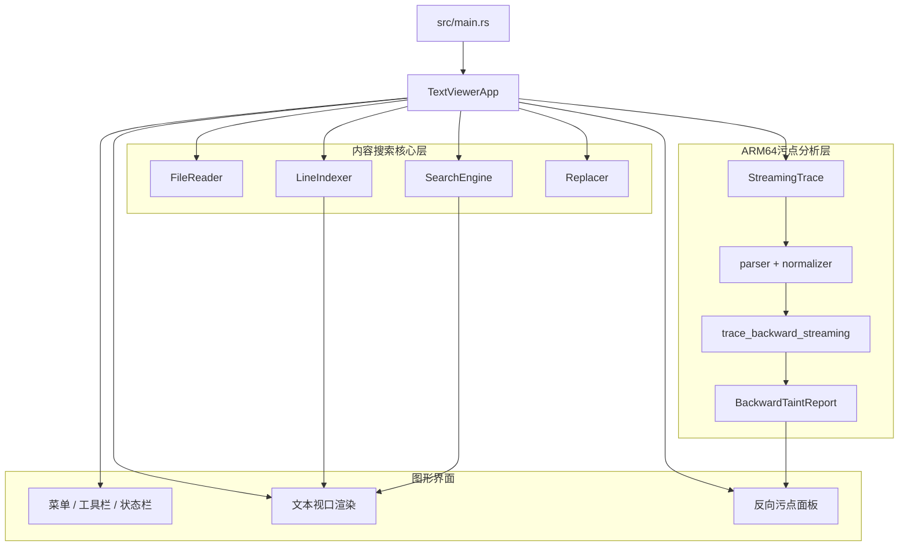

# Taint-Rev-Trace

> 支持 MCP 调用的 ARM Trace 污点追踪与快速搜索工具

`Taint-Rev-Trace` 是一个面向 ARM 架构执行 Trace 分析的 Rust 工作区。  
它以可视化界面为主要使用形态，把大体积 Trace 浏览、条件搜索、ARM64 反向污点追踪和 MCP 接口调用整合成一套完整工作流。

当前工作区包含三个核心部分：

- `content-search`：图形界面程序，负责 Trace 浏览、条件搜索、结果跳转、污点面板展示与 MCP 配置入口
- `content-search-core`：大文件读取、行索引、缓存索引、条件搜索、替换写回等基础能力
- `arm64-taint-core`：ARM64 Trace 解析、归一化、流式回溯、反向污点分析、报告生成与 MCP 服务

兼容性说明：

- 当前包名为 `content-search` 和 `content-search-core`
- 图形界面中展示的产品名称为 `Taint Rev Trace`

## 项目定位

这个项目主要面向以下分析需求：

1. 在不把整份 Trace 一次性读入内存的前提下，稳定浏览 GB 级执行日志
2. 通过条件搜索快速锁定可疑函数、寄存器、地址、字符串或内存访问
3. 针对指定寄存器切片或内存切片执行 ARM64 反向污点追踪
4. 通过 MCP 接口把搜索与污点能力接入集成开发环境、命令行工具和智能体工作流

它不是传统意义上的前向污点框架，而是一套基于既有执行轨迹的反向来源分析系统。

## 核心能力

### 1. 条件搜索

- 支持超大文本文件或 ARM Trace 文件打开与快速定位
- 支持普通文本搜索与正则条件搜索
- 支持大小写敏感与非敏感匹配
- 支持总命中计数、分页加载结果和命中跳转
- 支持按行窗口读取上下文，适合分析搜索命中点周边逻辑
- 支持单次替换和流式全量替换，适合批量修订或结果整理

### 2. 反向污点追踪

- 支持从寄存器切片或内存切片出发做反向来源分析
- 支持 `movk`、`csel`、`adrp + add`、`w` 写清零等关键 ARM64 语义
- 支持 `ldr/str` 及多次 store 的字节级覆盖回溯
- 支持来源概览、树状来源、步骤流和图摘要展示
- 支持自定义追踪深度、输出上限与剪枝选项
- 支持从搜索命中点直接发起追踪，形成“搜索 -> 解释”的闭环

### 3. MCP 调用

- 内置 `trace-search-mcp` 服务
- 支持文件检查、按行读取、条件搜索、单点替换、批量替换、独立污点追踪和组合搜索追踪
- 支持在图形界面 `Tools/工具` 菜单中进行 MCP 管理
- 支持一键全局安装到已检测到的 MCP 客户端
- 适合与 VS Code、Cursor、Claude Desktop、Claude Code、Codex CLI 等客户端环境联动

## 界面展示


## 典型工作流

### 工作流一：先搜索，再追踪

1. 打开目标 Trace 文件
2. 用条件搜索定位函数名、寄存器模式、地址常量或关键字符串
3. 选中目标行，在界面中指定寄存器或内存表达式
4. 发起反向污点追踪
5. 在来源概览、来源树和步骤流中理解数据来路
6. 必要时回跳原始 Trace 行号继续人工核验

### 工作流二：MCP 自动化分析

1. 启动 `trace-search-mcp`
2. 在支持 MCP 的集成开发环境或命令行客户端中接入该服务
3. 通过 `search_content` 搜索关键目标
4. 通过 `trace_backward` 或 `search_trace_sources` 获取来源解释
5. 将结果返回给脚本、插件或智能体继续处理

## 工作区结构

```text
.
|-- src/
|   |-- main.rs              # 图形界面入口
|   `-- app.rs               # 图形界面状态、渲染、搜索、污点面板、MCP 管理
|-- crates/
    |-- content-search-core/
    |   |-- README.md        # 内容搜索核心库说明
    |   `-- src/
    |       |-- file_reader.rs
    |       |-- line_indexer.rs
    |       |-- search_engine.rs
    |       `-- replacer.rs
    `-- arm64-taint-core/
        `-- src/
            |-- parser.rs
            |-- normalizer.rs
            |-- indexer.rs
            |-- streaming.rs
            |-- engine.rs
            |-- report.rs
            |-- bin/arm64-taint-cli.rs
            `-- bin/trace-search-mcp.rs
```

## 运行架构



## 核心运行流程

### 1. 文件打开与视口渲染

1. `TextViewerApp::open_file` 创建基于内存映射的 `FileReader`
2. `LineIndexer::index_file_cached` 优先尝试命中索引缓存，否则回退为重新建索引
3. `render_text_area` 通过 `egui::ScrollArea::show_rows` 仅绘制当前可见行
4. 每一行内容都根据字节偏移按需解码
5. 渲染阶段叠加搜索高亮、待写回替换项与污点标记

### 2. 条件搜索与替换

1. `perform_search` 配置 `SearchEngine` 并启动后台任务
2. “查找全部”会并行执行命中计数与首页结果抓取
3. `poll_search_results` 将流式结果并入界面状态，并支持结果跳转
4. 单条替换先进入 `pending_replacements`
5. 保存时通过 `Replacer::replace_single` 写回单项替换
6. “全部替换”通过 `Replacer::replace_all` 流式生成输出文件

### 3. ARM64 反向污点追踪

1. 用户选择目标行与寄存器或内存表达式
2. `run_taint_analysis` 校验输入并启动后台分析任务
3. 后台任务基于当前打开文件创建 `StreamingTrace`
4. `trace_backward_streaming` 将目标解析为具体切片节点
5. 引擎沿最近定义、内存写入、标志位和覆盖关系向后回溯
6. `report.rs` 生成摘要、来源树、图结构、步骤流与线性链
7. 图形界面展示结果，并把节点重新关联到原始 Trace 行号

### 4. MCP 服务调用

1. 启动 `trace-search-mcp`
2. MCP 客户端通过标准输入输出与服务建立连接
3. 调用文件检查、条件搜索、上下文读取或污点追踪工具
4. 服务端复用 `content-search-core` 与 `arm64-taint-core` 的能力返回结果
5. 外部集成开发环境、命令行工具或智能体继续消费这些结果

## MCP 工具清单

| 工具名 | 作用说明 |
| --- | --- |
| `inspect_content_file` | 检查文件、识别编码、构建或复用索引，并返回行数等基础信息 |
| `read_content_lines` | 按行窗口读取内容，适合跳转目标行和查看上下文 |
| `search_content` | 执行普通文本或正则条件搜索，并支持分页与总命中统计 |
| `replace_content_match` | 根据命中偏移替换单个结果 |
| `replace_content_all` | 执行流式全量替换 |
| `trace_backward` | 对指定行和目标切片执行独立反向污点追踪 |
| `search_trace_sources` | 先搜索，再对命中点批量执行来源分析 |

## 关键公共接口

### `content-search-core`

- `FileReader`
- `LineIndexer`
- `SearchEngine`
- `Replacer`

### `arm64-taint-core`

- `BackwardTaintRequest`
- `BackwardTaintOptions`
- `BackwardTaintReport`
- `StreamingTrace`
- `trace_backward`
- `trace_backward_streaming`
- `report_to_json`

## 常见修改入口

- Trace 格式兼容：`crates/arm64-taint-core/src/parser.rs`、`crates/arm64-taint-core/src/normalizer.rs`
- 反向切片语义：`crates/arm64-taint-core/src/engine.rs`、`crates/arm64-taint-core/src/report.rs`
- 大文件读取与流式定位：`crates/arm64-taint-core/src/streaming.rs`、`crates/content-search-core/src/file_reader.rs`、`crates/content-search-core/src/line_indexer.rs`
- 条件搜索与替换：`crates/content-search-core/src/search_engine.rs`、`crates/content-search-core/src/replacer.rs`
- 图形界面交互与模块联动：`src/app.rs`
- MCP 客户端安装与接入：`src/mcp_install.rs`
- MCP 服务入口：`crates/arm64-taint-core/src/bin/trace-search-mcp.rs`

## 构建与运行

### 图形界面

```bash
cargo build --release
cargo run
```

图形界面二进制名称为 `content-search`。

### 命令行污点追踪

```bash
cargo run -p arm64-taint-core --bin arm64-taint-cli -- <trace-file> --line <line_no> --reg <reg>
```

示例：

```bash
cargo run -p arm64-taint-core --bin arm64-taint-cli -- sample.txt --line 72 --reg x8 --bits 0:31
```

### MCP 服务

```
cargo build -p arm64-taint-core --bin trace-search-mcp --release
```

```bash
cargo run -p arm64-taint-core --bin trace-search-mcp
```


## 相关文档

- `docs/McpTools.md`：MCP 工具说明与调用示例
- `docs/Architecture.md`：项目架构说明
